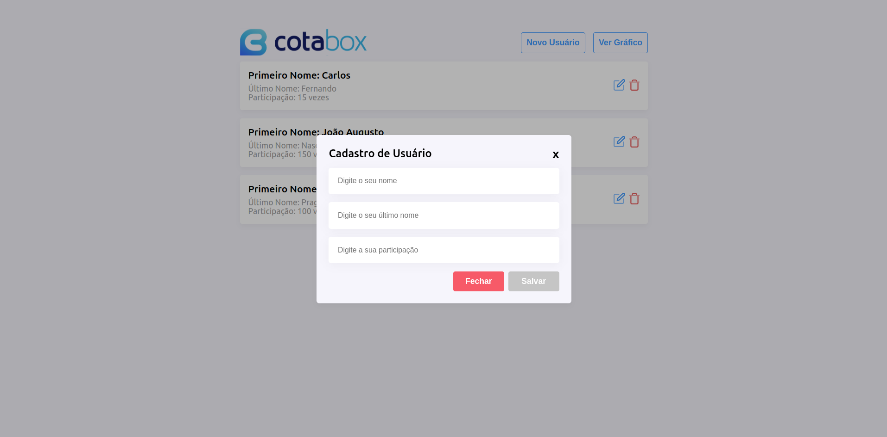
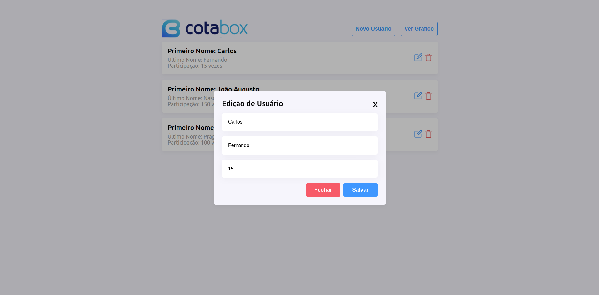
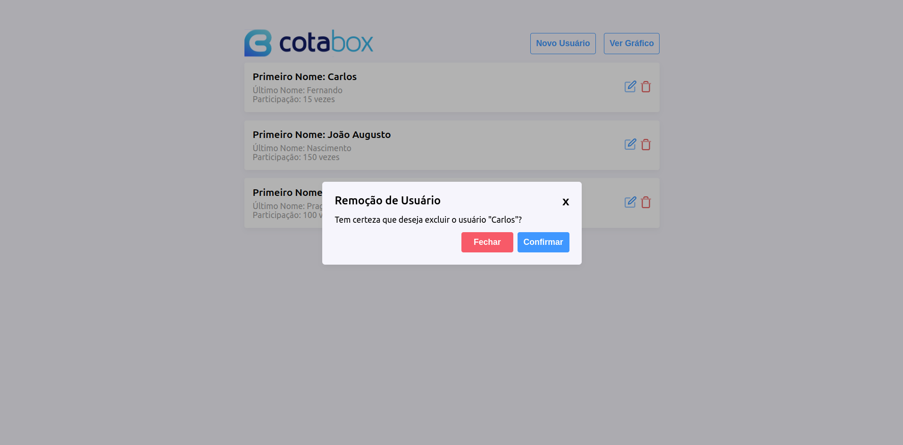
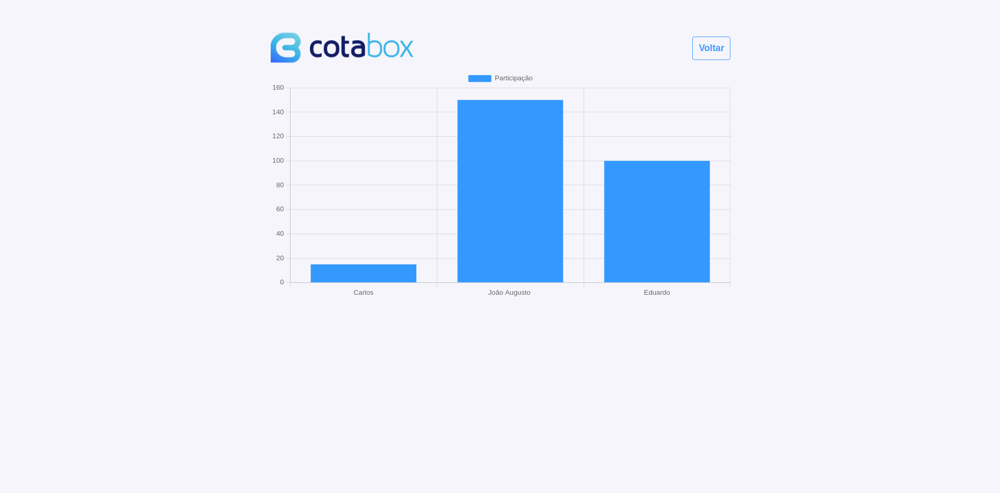

# Desafio FullStack com Vue.js, Nest.js e Graphql.

<h1></h1>
<h1></h1>
<h1></h1>
<h1></h1>
<h1></h1>
<h1></h1>

## Como rodar o projeto:

### Clone o repositorio

```
$ git clone https://github.com/augustodevjs/challenge-cotabox-fullstack.git
```

### Entre no diretório do backend

```
$ cd ./backend

crie um arquivo .env e copie os dados do .env.example para esse arquivo
```

### Instale as dependências

```
$ npm install
```

### Rode o comando do docker

```
$ docker compose up --build

Certifique-se que a porta 5432 na sua máquina está liberada.
Após isso entre na url -- localhost:3000/graphql
```

### Rode o comando para caso queira vê os testes unitários

```
$ npm run test
```

### Entre no diretório do frontend

```
$ cd ./frontend
```

### Instale as dependências do node_modules

```
$ npm install
```

### Rode o projeto

```
$ npm run serve

Entre na url -- localhost:8080
```
